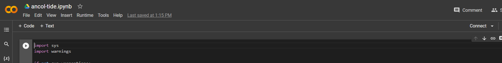

# Ancol Tide
Aplikasi Ancol Tide merupakan sebuah aplikasi berbasis website informasi mengenai prediksi pasang surut air laut di wilayah Ancol, Jakarta Utara. 

 

Model aplikasi deep learning dengan algoritma Long Short Term Memory (LSTM) untuk memprediksi pasang surut air laut di wilayah Ancol, Jakarta Utara. 

**Try online on google colab**: 
- [Ancol Tide](https://colab.research.google.com/drive/1IyHaYLCPLRurVs-tJJRLbCcO4kr1xlOi?usp=sharing)

Website Ancol Tide:
- Education
- Image Prediction
- Graph Prediction

## Features

- Prediksi pasang surut dengan visualisasi gambar selama 9 bulan kedepan
- Prediksi pasang surut dengan grafik untuk 30 hari kedepan

**Usage for online colab**:

- Click the connect

  

- Open on ``runtime`` and click run all ( ``ctrl+f9`` if using shortcut )
  
  

 
# Examples

| prompt | image |
| ------ | ----- |
| 2 Simulation |  |
| 5 Simulation |  |

---

